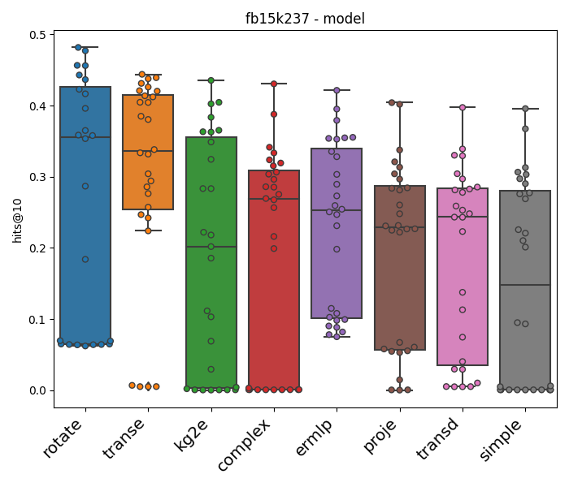
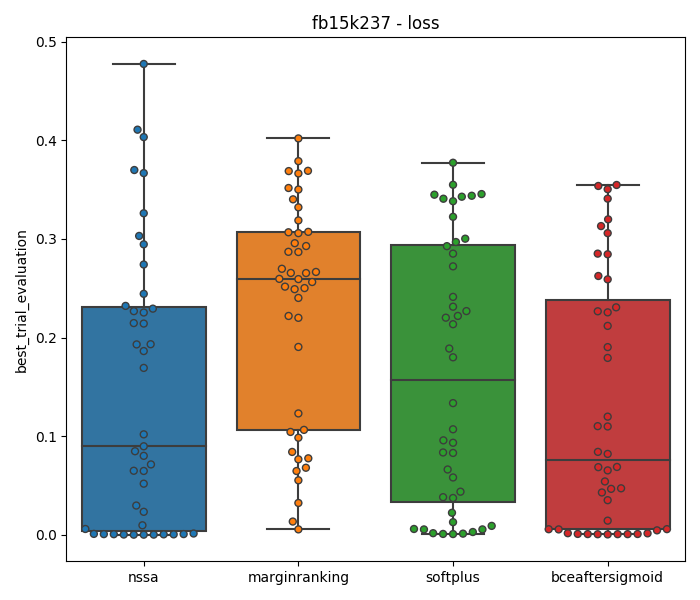
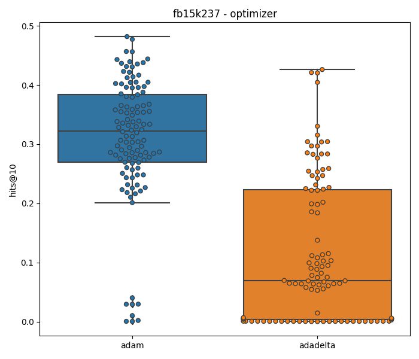
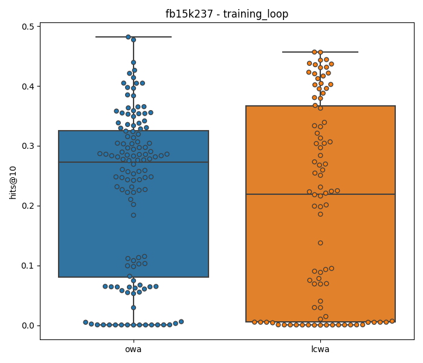
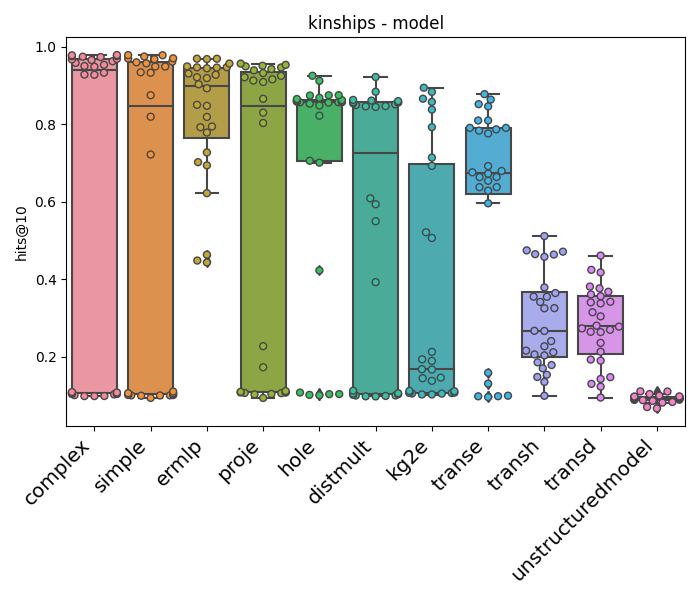
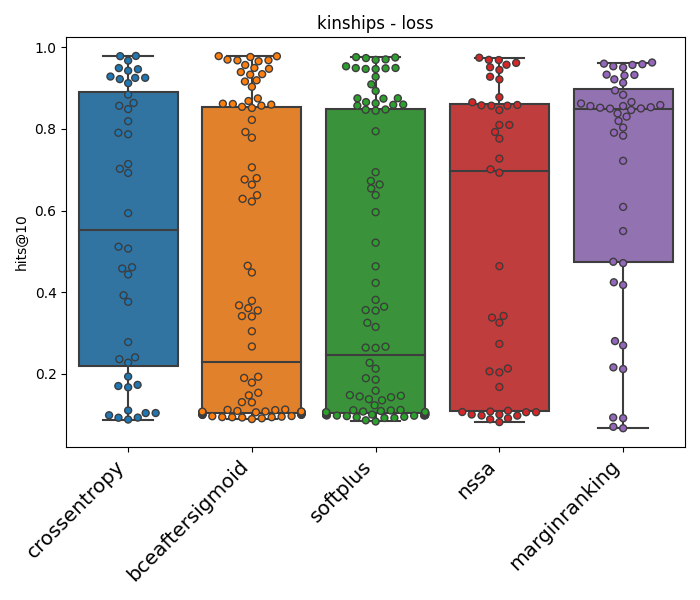
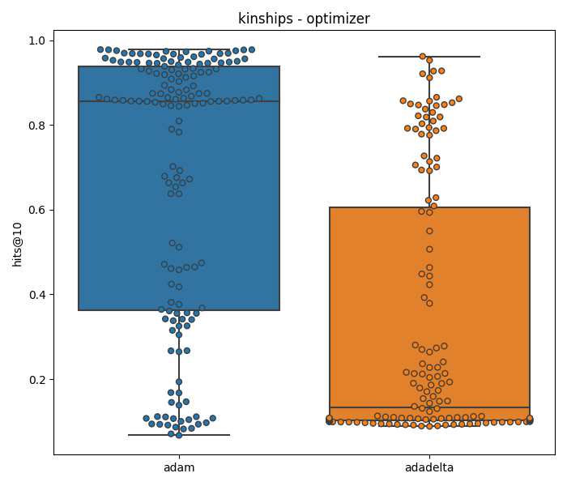
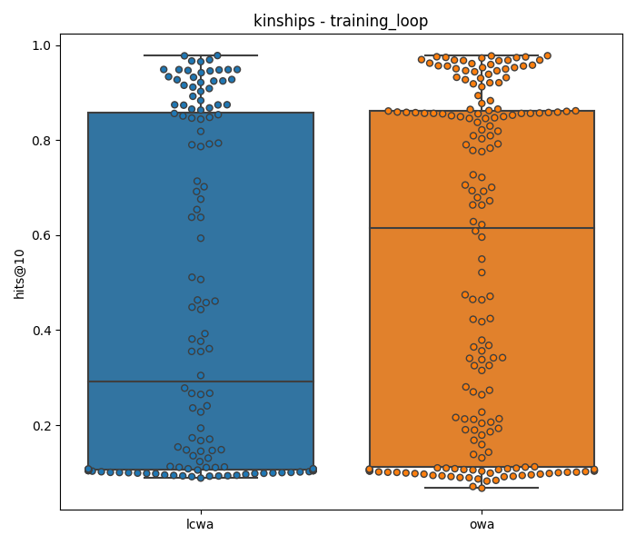

# HPO Ablation Results

Output at Sat Mar 21 18:44:19 2020

## fb15k237

### fb15k237 model

### fb15k237 loss

### fb15k237 optimizer

### fb15k237 training_loop

## kinships

### kinships model

### kinships loss

### kinships optimizer

### kinships training_loop

