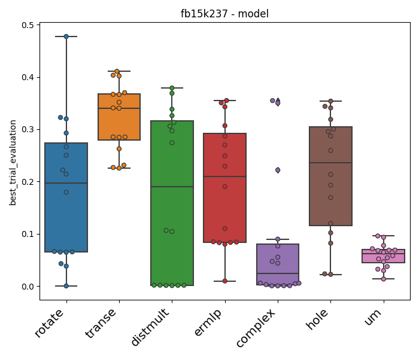
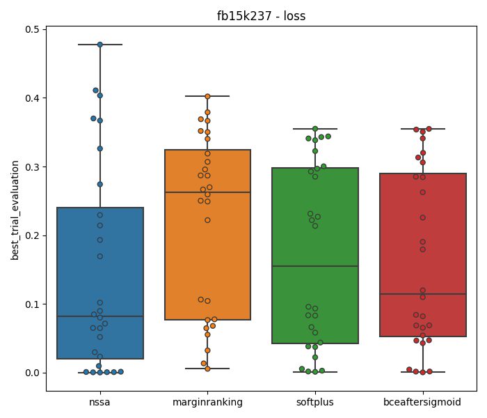
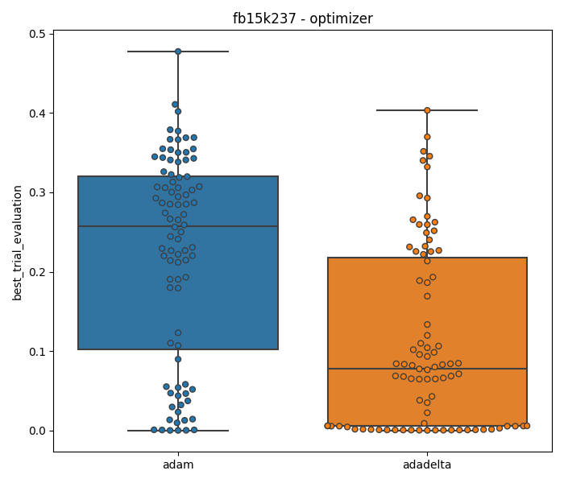
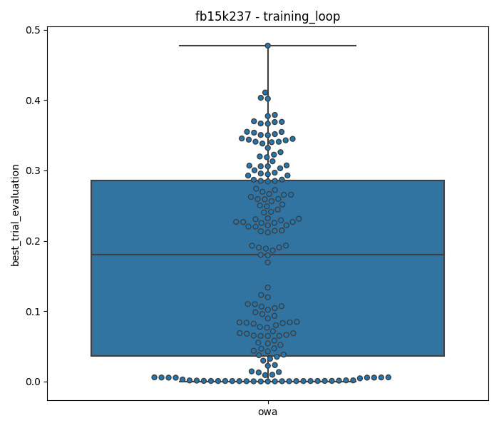
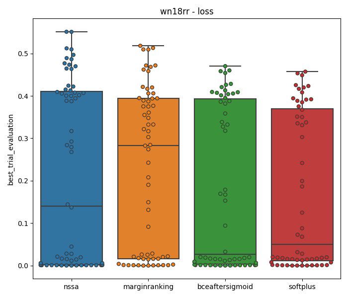

# HPO Ablation Results

Output at Thu Jan 23 14:18:30 2020

## fb15k237

### model

### loss

### optimizer

### training_loop

## wn18rr

### model

### loss

### optimizer

### training_loop

